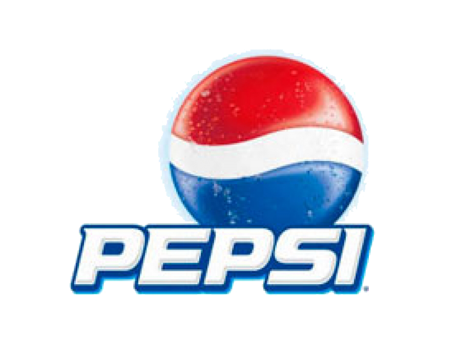

# Project Title

This is a small case-study I made for a company.

Main feature is a function which takes image, logo, color information as input and outputs a stable diffusion based ad template using these inputs.

App is deployed with flask. Sending a post request with below format will return an base64 encoded result image. 

    data = {

    "operation": “”,

    "base_image":base_img,

    "logo_image":logo,

    "hex_code_diffusion": hex_code_diffusion,

    "hex_code_punchline": hex_code_punchline,

    "hex_code_button": hex_code_button,

    "punchline": punchline,

    "button_text": button_text

   }

All details can be found in test.py and api.py

Demo Inputs:

Demo Output:

